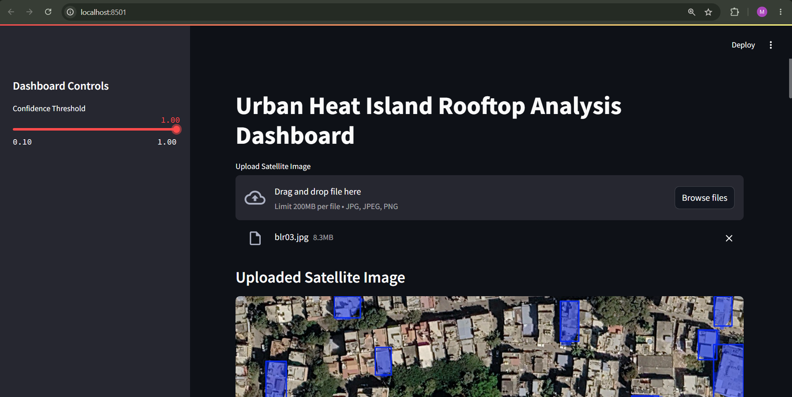
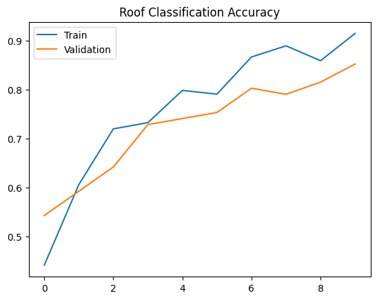
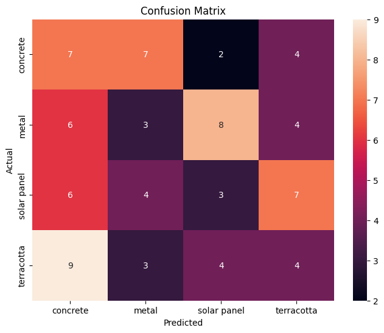
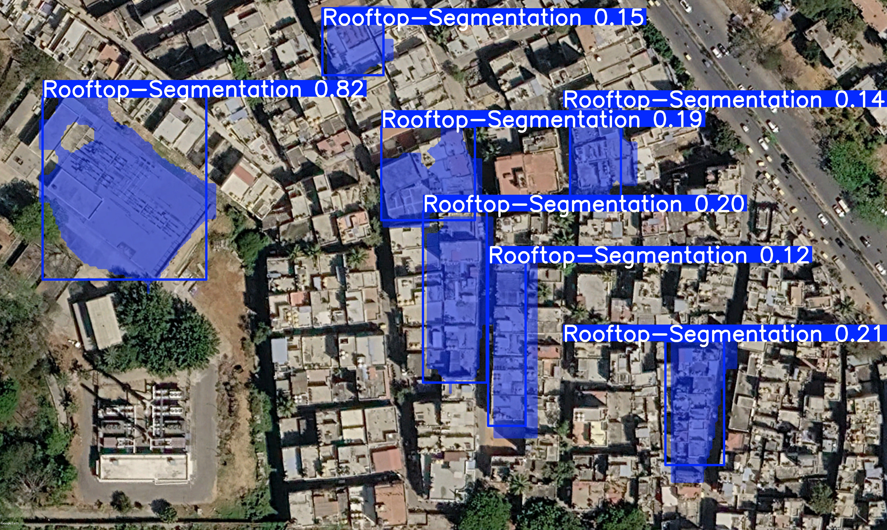
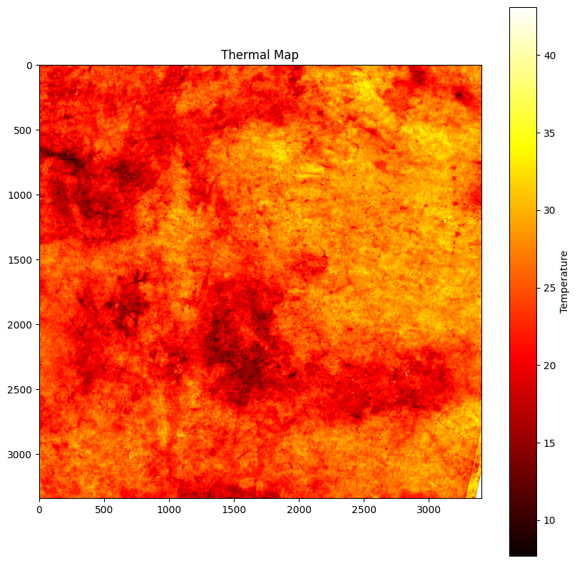

<div align="center">

# 🌍 Urban Heat Mapping via Rooftop Segmentation, Roof Type Classification & Thermal Analysis

### AI-powered Rooftop Segmentation, Roof Type Classification & Urban Heat Island Analysis using YOLOv8


</div>

---

## 📖 Project Overview

Urban Heat Islands (UHI) occur when urban regions experience significantly higher temperatures than surrounding rural areas due to dense infrastructure, reduced vegetation, and heat-absorbing building materials.

This project combines **Computer Vision**, **Deep Learning**, and **Remote Sensing** to automatically detect rooftops from satellite imagery, classify roof types, estimate rooftop temperatures using **Land Surface Temperature (LST)** data, and visualize the results through an interactive **Streamlit dashboard**.

---

# 🚀 Dashboard Preview

<p align="center">

</p>

---

# ✨ Features

- 🛰️ Automatic rooftop detection using YOLOv8
- 🏠 Roof type classification
- 🌡️ Land Surface Temperature (LST) analysis
- 🔥 Rooftop thermal hotspot identification
- 📊 Interactive temperature statistics
- 📈 Real-time visualizations
- 💻 Streamlit-based dashboard

---

# 🛠 Tech Stack

### Programming Language

- Python

### Deep Learning

- YOLOv8 (Ultralytics)
- TensorFlow / Keras
- PyTorch

### Computer Vision

- OpenCV
- Pillow

### Data Processing

- NumPy
- Pandas
- Rasterio

### Visualization

- Matplotlib
- Streamlit

### Machine Learning

- Scikit-learn

### Annotation Tool

- Roboflow

### Development Environment

- Google Colab
- VS Code
- Git & GitHub

---

# 📂 Project Structure

```text
Urban-Heat-Mapping-via-Roof-Type-Classification
│
├── app.py
├── README.md
├── requirements.txt
├── LICENSE
│
├── assets/
│
├── data/
│   └── bangalore_lst.tif
│
├── models/
│   └── best.pt
│
├── notebooks/
│
├── outputs/
│
├── sample_images/
│
└── docs/
```

---

# ⚙️ Installation

### Clone the repository

```bash
git clone https://github.com/monishasrinivas-04/Urban-Heat-Mapping-via-Roof-Type-Classification.git
```

### Move into the project folder

```bash
cd Urban-Heat-Mapping-via-Roof-Type-Classification
```

### Install dependencies

```bash
pip install -r requirements.txt
```

### Run the dashboard

```bash
streamlit run app.py
```

---

# 🔄 Project Workflow

```text
Satellite Image
        │
        ▼
YOLOv8 Rooftop Segmentation
        │
        ▼
Roof Detection
        │
        ▼
Roof Type Classification
        │
        ▼
Land Surface Temperature Mapping
        │
        ▼
Roof Temperature Analysis
        │
        ▼
Interactive Streamlit Dashboard
```

---

# 📊 Model Performance

<table>
<tr>

<td align="center">

### Training & Validation Accuracy



</td>

<td align="center">

### Confusion Matrix



</td>

</tr>
</table>

---

# 🛰️ Results

<table>
<tr>

<td align="center">

### Rooftop Segmentation



</td>

<td align="center">

### Land Surface Temperature



</td>

</tr>
</table>

---

# 📈 Dashboard

<p align="center">

</p>

The Streamlit dashboard enables users to upload satellite imagery, perform rooftop detection using YOLOv8, estimate rooftop temperatures using Land Surface Temperature (LST) data, and visualize Urban Heat Island patterns through interactive charts, heatmaps, and statistical summaries.

---

# 📌 Key Outcomes

- Successfully detected rooftops from high-resolution satellite imagery.
- Classified rooftops into multiple roof material categories.
- Estimated rooftop temperatures using LST data.
- Generated thermal heatmaps for urban heat analysis.
- Developed an interactive Streamlit dashboard for visualization.

---

# 🔮 Future Enhancements

- 🌱 Green Roof Detection
- ☀️ Solar Rooftop Suitability Analysis
- 🗺️ GIS Integration
- 🛰️ Real-time Satellite Image Processing
- 🏙️ Building-wise Heat Risk Assessment
- 🌍 Urban Sustainability Index (UHSI)
- 🤖 Improved Roof Type Classification using Transfer Learning

---

# 👩‍💻 Author

**Monisha S**

B.Tech – Artificial Intelligence & Machine Learning

M. S. Ramaiah University of Applied Sciences

🔗 GitHub: https://github.com/monishasrinivas-04

---

# 🙏 Acknowledgements

- AICTE
- Edunet Foundation
- Shell India
- Ultralytics
- Roboflow
- Streamlit

---

<div align="center">

⭐ If you found this project interesting, consider giving it a star!

</div>